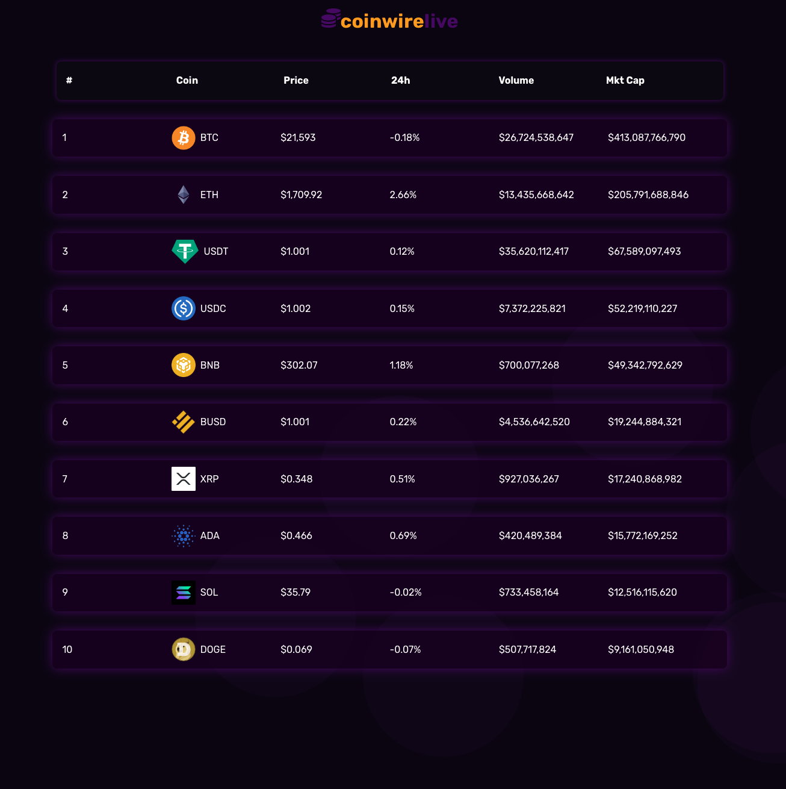
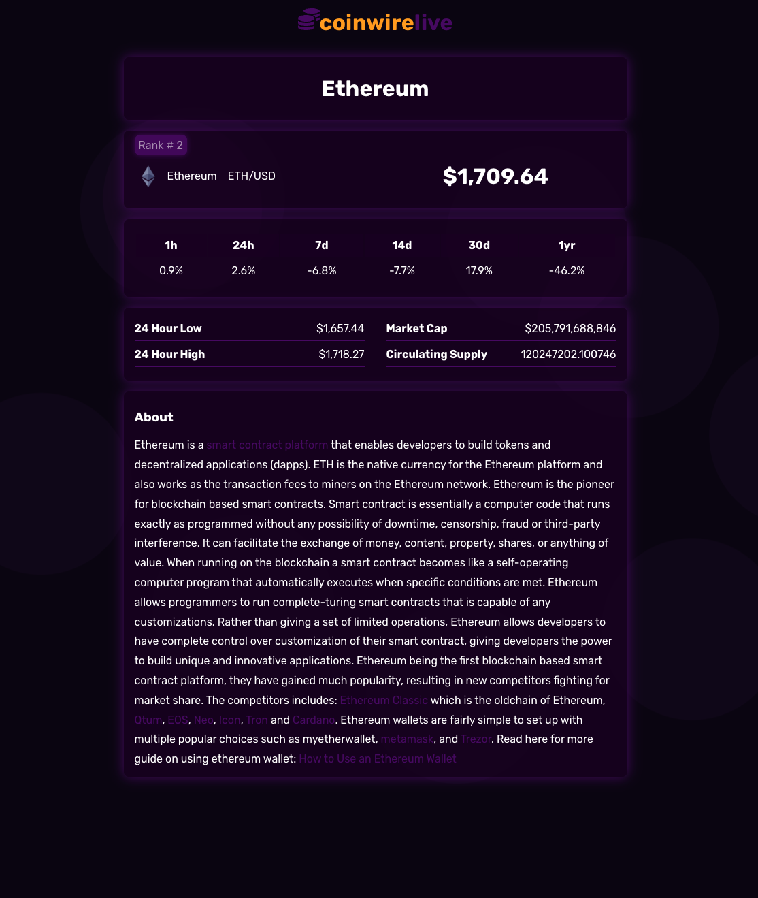

# coinwirelive.web from create react app starter

Coingecko API with CRA, D3 and Vanilla CSS/vars... 

[Live Firebase Hosting Site](https://coinwirelive.web.app)

[Firebase Project Console](https://console.firebase.google.com/project/coinwirelive/overview)

 

-   d3 for circles and animated bar charts
-   d3 for line graph spark/trending *(coming soon)*
-   vanilla css with css-vars
-   react app
-   firebase Hosting
-   custom logo *(coming soon)*
-   deployed last 8-25-2022

### CRA Start...

This project was bootstrapped with [Create React App](https://github.com/facebook/create-react-app).

## Available Scripts

In the project directory, you can run:

### `yarn start`

Runs the app in the development mode.\
Open [http://localhost:3000](http://localhost:3000) to view it in your browser.

The page will reload when you make changes.\
You may also see any lint errors in the console.

### `yarn build`

Builds the app for production to the `build` folder.\
It correctly bundles React in production mode and optimizes the build for the best performance.

The build is minified and the filenames include the hashes.\
Your app is ready to be deployed!
